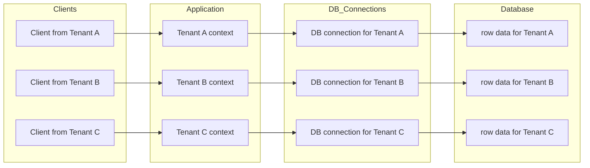
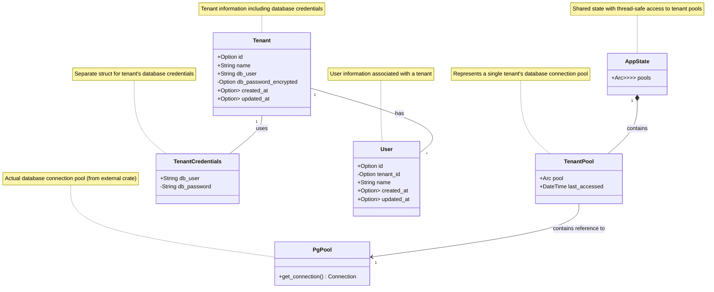
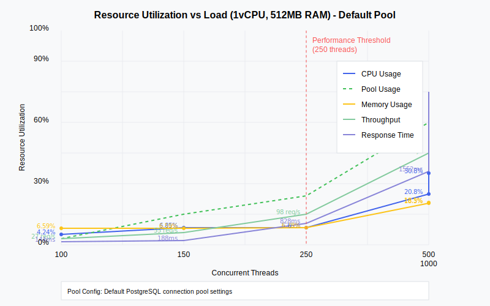

# Multi-Tenant Architecture template written in Rust for PostgreSQL
Multi-threaded DB pool lifecycle management implementation is available in the source provided.

[](https://github.com/alexandrughinea/rust-actix-postgres-multi-tenant/actions/workflows/rust.yml)
[](https://opensource.org/licenses/MIT)

This project implements a blazingly fast (yes, really fast 🔥) multi-tenant connection pooling strategy for PostgreSQL using Rust.
It dynamically manages database connection pools for tenants based on their unique identifiers (UUIDs).
The architecture leverages the use of `Arc` (Atomic Reference Counting), `Mutex`, and SQLx to ensure efficient, safe, and scalable connection management in a multi-threaded environment.

## Table of Contents
- [Overview](#overview)
- [Architecture](#architecture)
- [Components](#components)
- [How it Works](#how-it-works)
- [Benefits](#benefits)
- [Documentation](#documentation)
- [Disclaimer](#disclaimer)

## Overview

In a multi-tenant application, each tenant often requires its own isolated database or schema.
Managing connections to these tenants in an efficient way is extremely critical for performance and resource re-utilization.
This project provides one way to handle tenant-specific database connections using connection pools that are cached and reused, ensuring optimized resource management.
The main database we're working with is going to be PostgreSQL and it assumes that RLS (Row Level Security) is enabled as a security policy for each connecting tenant as the following diagram:


Each tenant role has its own credentials stored and encrypted (not hashed) at rest with an AES256 GCM algorithm.
The encryption key is not part of the app binary and is configured per environment.

The architecture supports:
- **Tenant-specific connection pooling**: A separate connection pool for each tenant, ensuring a good level of isolation between tenants.
- **Efficient reuse of connections**: Pools are cached and reused to avoid repeatedly creating and tearing down connections.
- **Pool eviction strategy**: Pools are evicted and cleaned up if they become stale by an automatic background task.
- **Thread-safe management**: Using `Arc` and `Mutex` to ensure that connection pools can be accessed and modified safely in a multi-threaded environment, without cloning them.

## Architecture

### Components

- **`AppState`**: A global state shared across the application that holds all tenant connection pools in a thread-safe manner using a `Arc<Mutex<HashMap<Uuid, Arc<Mutex<TenantPool>>>>>`. This allows tenant-specific pools to be fetched, inserted, and updated safely. Each tenant can have their own credentials, and these pools are isolated from one another.

- **`TenantPool`**: A struct representing the connection pool for a specific tenant, along with some metadata such as the last time it was accessed. This metadata helps with our eviction policies if needed.

- **PostgreSQL Pool (`PgPool`)**: The principal pool of database connections which initializes once with the application.

### Diagram



## How it Works

1. **Request Handling**:
   - When a request is made on behalf of a tenant, the `tenant_id` (UUID) is extracted from the request.

2. **Connection Pool Lookup**:
   - The system checks if there is an existing connection pool for that tenant in the `AppState`. The pool is stored in a thread-safe `HashMap`, with the `tenant_id` as the key and an `Arc<Mutex<TenantPool>>` as the value.

3. **Pool Creation** (if not found):
   - If no connection pool is found for the tenant, the system fetches tenant-specific database credentials and creates a new `PgPool`.
   - The `PgPool` is stored inside a `TenantPool` struct, along with the `last_accessed` timestamp, and the entire `TenantPool` is stored inside an `Arc<Mutex<_>>` for safe access.

4. **Safe Access and Mutation**:
   - When accessing or modifying a `TenantPool`, the system uses `Mutex` locks to ensure safe concurrent access.
   - The `last_accessed` field is updated whenever the tenant’s pool is retrieved, allowing optimizations such as evicting idle pools.

5. **Reusing Pools**:
   - Once a pool is created for a tenant, subsequent requests from that tenant reuse the same pool, avoiding the overhead of creating new connections repeatedly.

## Benefits

### 1. **Efficient Connection Management**:
- The architecture ensures that connections to tenant databases are pooled and reused. Each tenant gets its own `PgPool`, and the pool is created only when needed, reducing overhead.

### 2. **Scalability**:
- By using `Arc` to share ownership and `Mutex` for thread-safe access, this system can scale across multiple threads, allowing safe concurrent requests to access and modify tenant pools.

### 3. **Optimized Resource Usage**:
- The architecture reduces the cost of frequently opening and closing database connections by keeping idle connections around for a specified amount of time (configurable using the `idle_timeout` setting).

### 4. **Isolation Between Tenants**:
- Each tenant’s database pool is isolated, ensuring that tenants don’t interfere with one another’s connections. This is crucial for maintaining security and data integrity in multi-tenant systems.

### 5. **Cache Management**:
- The `last_accessed` timestamp for each pool allows the system to track activity and potentially implement strategies like idle pool eviction or pool timeouts, further improving resource management.

## Documentation

For extra info you should really check out the `documentation/` directory.
I have left some resources that I think could bring even more insight.

It is split in three main sections:
- Stress test results for custom and default pool settings: [stress test results](./documentation/stress_test)
- SQL migration steps with comments:  [SQL docs](./documentation/sql)
- [Bruno](https://github.com/usebruno/bruno) API collections: [Bruno templates](./documentation/bruno)

### Stress test result example

#### Result format (jmx output) [512GB_1vCPU_250_CT_summary](./documentation/stress_test/default_pool_options/512GB_1vCPU_250_CT_summary.csv):

| Label                    | # Samples | Average | Min | Max  | Std. Dev. | Error % | Throughput | Received KB/sec | Sent KB/sec | Avg. Bytes |
|--------------------------|-----------|---------|-----|------|-----------|---------|------------|----------------|-------------|------------|
| Thread Group:HTTP Request | 5000      | 828     | 83  | 3326 | 604.89    | 0.000%  | 98.33035   | 260.61         | 25.45       | 2714.0     |
| TOTAL                    | 5000      | 828     | 83  | 3326 | 604.89    | 0.000%  | 98.33035   | 260.61         | 25.45       | 2714.0     |

#### Result graph - Resource Utilization vs Load (1vCPU, 512MB RAM) - Default Pool:


## Usage

### Prerequisites
- Rust
- PostgreSQL
- SQLx with PostgreSQL feature

### Setting up the Project

1. Clone the repository:
   ```bash
   git clone <repository-url>
   ```
2.	Configure your own PostgreSQL connection settings for your tenants.
      Look for .env and enable it accordingly.

3. Seed your `tenants` table accordingly (see `/sql` directory)

4. Making tenant specific requests

- `POST` request to create a user for a specific tenant:
  ```bash
  curl -X POST https://localhost:8080/v1/internal/users \
       -H "x-tenant-id: 1b7db059-91bc-42d6-9d0e-93ca03d644a8" \
       -H "Content-Type: application/json" \
       -d '{
             "name": "John Doe",
           }'
  ```

- `GET` request to retrieve users of a specific tenant:
  ```bash
  curl -X GET https://localhost:8080/v1/internal/users \
     -H "x-tenant-id: 1b7db059-91bc-42d6-9d0e-93ca03d644a8"
  ```
Be sure to add an existing and correct tenant unique identifier in the headers (must be UUID v4)

## Disclaimer

This should be considered a starting point or a good conversation starter.
It is missing many important items such as a proper build pipeline, telemetry and security aspects such as a secret vault for storing database connection credentials or a rotating encryption key, etc.
Please be sure to upgrade your security posture.